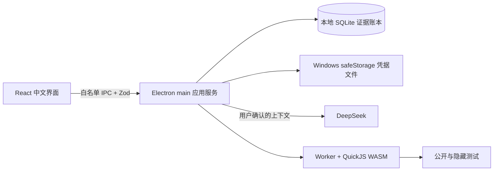

# DevReplay

DevReplay 是一个 Windows 本地优先的程序员面试复盘与训练 Agent。它把真实面试中的问题转成可追溯证据、能力画像和可验收训练，并通过间隔复测或后续真实面试验证缺口是否真正闭环。

## 它解决什么

普通对话 Agent 擅长一次性回答；DevReplay 维护跨会话的面试状态、证据账本、训练契约和复测计划。每个能力判断都能回到来源，模型建议必须经过用户确认，训练通过也不会直接宣称“稳定”。

Non-goals：不做招聘平台、不代替面试官决策、不抓取职位、不自动投递、不提供云同步、不把单次模型判断当作能力事实，也不在 Alpha 中执行 Node/DOM/网络类代码题。

## 架构



renderer 启用 context isolation、sandbox 并关闭 Node integration；数据库和凭据只在 main 进程中访问。QuickJS 在独立 Worker 内执行 JavaScript/TypeScript 训练代码，父线程负责硬超时。

## 隐私边界

- 面试、简历、JD、证据、训练和模型审计默认只保存在本机 SQLite。
- API Key 使用 Electron `safeStorage` 加密后写入独立文件，不进入 SQLite、导出 JSON、日志或模型审计。
- 只有用户检查并确认“发送预览”后，所选内容才会发送到 DeepSeek；应用不含遥测 SDK。
- JSON 导出是明文，请由用户自行保管。设置页可明确查看范围后清除业务数据和 DevReplay 凭据。

## 开发环境

需要 Windows 10/11 x64、Node.js 22.19+、pnpm 11.19。

```powershell
pnpm install --frozen-lockfile
pnpm dev
```

质量与构建命令：

```powershell
pnpm format:check
pnpm lint
pnpm typecheck
pnpm test
pnpm --filter @devreplay/desktop smoke:security
pnpm --filter @devreplay/desktop release:win
```

Windows 安装包和 `.sha256` 文件输出到 `apps/desktop/dist/`。

## DeepSeek 配置

首次进入后打开右上角“DeepSeek 设置”，填写模型 ID 与 API Key。默认模型为 `deepseek-chat`。DevReplay 不会回显密钥，也不会在失败时自动切换模型。离线、鉴权、限流、超时或结构校验失败后，输入保留在本机并可重试。

## Demo 黄金路径

无需 API Key：完成首次本地初始化，打开“DeepSeek 设置”并点击“一键装载 Demo”。返回后可从“今日”看到到期复测，从“面试”查看已完成复盘，从“训练”进入合成任务，从“画像”查看支持/反驳证据。点击“仅清除 Demo”只删除 `dataset_kind=demo` 的登记数据，不触碰真实记录。

## Alpha 安装提示

Alpha 安装包暂未进行商业代码签名，Windows SmartScreen 可能显示“Windows 已保护你的电脑”。从项目 GitHub Releases 下载后，先核对同名 `.sha256`；确认来源与校验值无误，再选择“更多信息”→“仍要运行”。若来源或摘要不匹配，请勿安装。

已知问题与双系统实机验收记录见 `docs/release/windows-alpha-checklist.md`。

## 设计记录与贡献

关键选择记录在 `docs/adr/`。开发约定见 [CONTRIBUTING.md](CONTRIBUTING.md)，许可证为 [Apache-2.0](LICENSE)。
